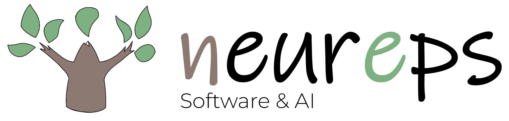

  

  <a href="https://neureps.com"><b>neureps.com</b></a> ·
  <a href="https://neureps.com/support/">지원</a> ·
  <a href="https://neureps.com/privacy/">개인정보처리방침</a>

---

**주식회사 뉴렙스(Neureps Inc.)** 는 2026년 경기도 용인에서 시작한 소프트웨어 스타트업입니다. 일상에서 매일 쓰이는 모바일 앱을 직접 기획하고 개발하며, 머신러닝과 생성형 AI 기술을 제품에 자연스럽게 녹여내는 일을 합니다.

저희는 기술이 나무와 닮았다고 생각합니다. 좋은 자리에 심고, 꾸준히 돌보면, 어느 순간 사람들에게 그늘과 열매를 돌려줍니다. 뉴렙스라는 이름과 두 팔을 벌린 나무 로고에는 그렇게 오래 자라는 소프트웨어를 만들겠다는 다짐을 담았습니다.

지금은 첫 번째 앱을 준비하고 있습니다. 작은 팀이지만, 만드는 것 하나하나를 끝까지 책임지는 회사가 되겠습니다.

이 저장소는 뉴렙스 공식 웹사이트([neureps.com](https://neureps.com))의 소스입니다.

---

  © 2026 Neureps Inc. · <a href="mailto:contact@neureps.com">contact@neureps.com</a>

